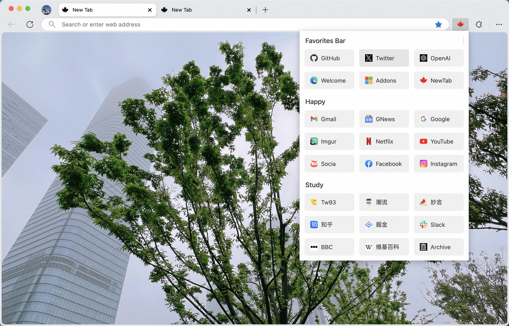
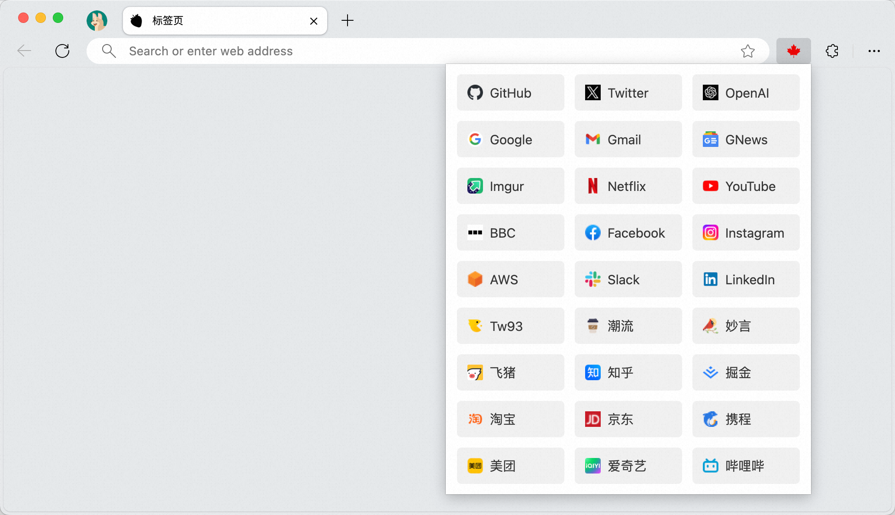
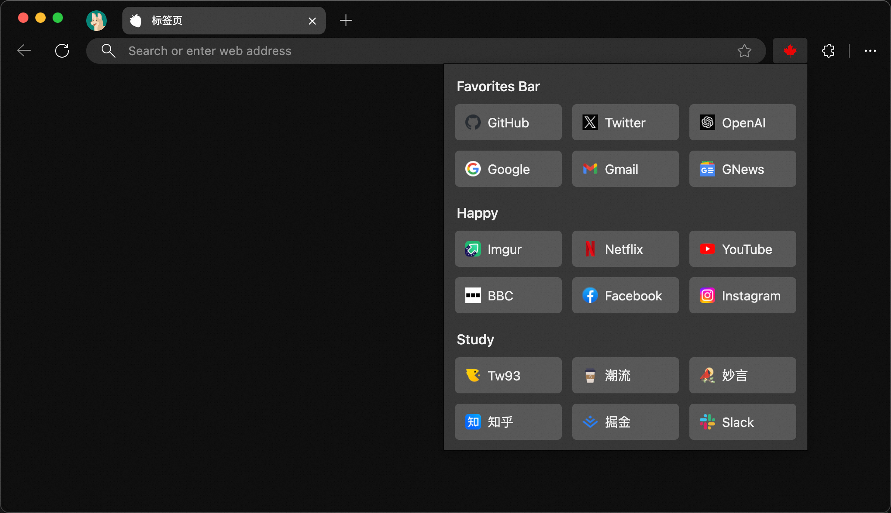

=<h4 align="right"><strong>中文</strong> | <a href="https://github.com/tw93/Maple/blob/main/README_EN.md">English</a></h4>

    
<h1 align="center">枫叶书签</h1>

    
    
    
    

隐藏书签栏，使用 <code>枫叶书签</code> 让你行云流水。

## 介绍

书签栏会占据浏览窗口且影响专注力，我常将其隐藏。但这使得访问书签很不方便，因此我开发了枫叶书签扩展，只需使用快捷键 `Command + E`(Mac)、`Ctrl+B`(Windows) 就能快速访问书签，甚至可以输入即搜索，实用且方便。

<kbd>
  
</kbd>
 

🏂 <strong>更多效果可以展开查看</strong>

<table>
  <tr>
      <td></td>
      <td></td>
  </tr>
  <tr>
      <td></td>
      <td></td>
  </tr>
</table>

## 安装

- 使用 Chrome Web Store 来安装 [**Maple Bookmarks**](https://chrome.google.com/webstore/detail/maple-bookmarks/lgncmpklmepncbjpiebhdoejhmbcnjad)，假如好用很欢迎评价。
- 假如你不可访问，可以下载 [Maple.zip](https://github.com/tw93/Maple/raw/main/resource/Maple.zip)，解压以后，参考 [Loading an unpacked extension](https://developer.chrome.com/docs/extensions/mv3/getstarted/development-basics/#load-unpacked) 来使用本地包。

## 标签页

1. 由于 Chrome 的原因，即使隐藏掉书签栏，在默认标签页上还有，可以用 [Maple NewTab](https://chrome.google.com/webstore/detail/maple-newtab/fobmbldflolfooglijmbibmnhoflbjlb/related?hl=en&authuser=0) 扩展来替换掉，这样就可彻底隐藏掉书签栏了。
2. `Maple NewTab` 当前支持`空白纯净页`、`潮流周刊图`、`Bing 图`三种形式的效果，光标放置背景图上，等待 2s 会出现切换框，点击即可切换。
3. 假如你更喜欢现在自己的标签页，可以在扩展中移除掉 `Maple NewTab`，这样就能恢复到默认标签页了。

## 实践

1. 先整理好书签，可以调整常用顺序以及删除不常使用的，有文件夹的放后面，让它更整齐。
2. 使用 `Command+Shift+B`(Mac)、`Ctrl+Shift+B`(Windows)，或者在书签栏上右键隐藏掉书签栏。
3. 点击扩展图标，将 `Maple Bookmarks` 给固定到工具栏上。
4. 试试使用 `Command + E`(Mac)、`Ctrl+B`(Windows) 来快速访问书签吧。
5. **假如你的书签很多，可以直接输入关键词来搜索，支持中文、英文、域名等**，默认不开启搜索，使用快捷键 ctrl + s 或者点击界面上方小箭头打开搜索模式。
6. 每次搜索会在最上方保留最匹配的三个结果（下次打开时会保留最后一次搜索），通过键盘的 ← 和 → 可以快速切换最匹配结果，并通过键盘 Enter 键快速打开高亮的选中书签。

## 支持

1. 我有两只猫，假如让你生活更美好，可以给猫 <a href="https://miaoyan.app/cats.html?name=Maple" target="_blank">喂罐头 🥩</a>。
2. 如果你喜欢枫叶书签，可以在 Github Star 它，更欢迎推荐给你志同道合的朋友。
3. 可以关注我的 [Twitter](https://twitter.com/HiTw93) 获取到版本更新消息，也欢迎加入 [Telegram](https://t.me/+GclQS9ZnxyI2ODQ1) 聊天群。
