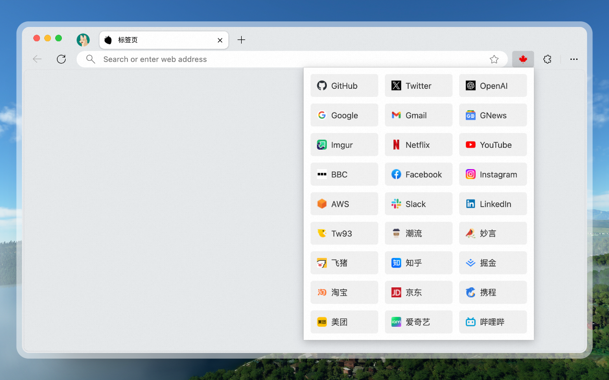
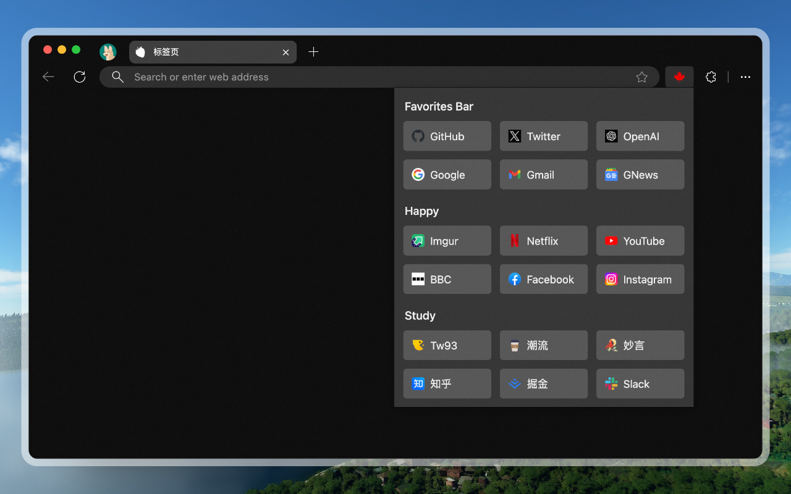

<h4 align="right"><strong>English</strong> | <a href="https://github.com/tw93/Maple">中文</a></h4>

    
<h1 align="center">Maple Bookmarks</h1>

    
    
    
    

Hide the bookmark bar, use <em>Maple Bookmarks</em> to surf smoothly.

## Introduction

The bookmarks bar can occupy the browsing window and affect concentration, so I often hide it. However, this makes accessing bookmarks inconvenient. Therefore, I developed the Maple Bookmarks extension. By just using the shortcut `Command + E`, you can quickly access your bookmarks, which is practical and convenient.

<kbd>
  
</kbd>

 

🏂 <strong>More effects can be expanded to view.<strong>

 
<table>
  <tr>
      <td></td>
      <td></td>
  </tr>
  <tr>
      <td></td>
      <td></td>
  </tr>
</table>

## Installation

- You can install Maple Bookmarks using Chrome Web Store. If you find it useful, please leave a review.
- If you cannot access the store, you can download [Archive.zip](./resource/Archive.zip). After decompressing, follow the instructions for [Loading an unpacked extension](https://developer.chrome.com/docs/extensions/mv3/getstarted/development-basics/#load-unpacked) to use the local package.

## Practice

1. First, organize your bookmarks. You can adjust the order of frequently used ones and delete those not often used to make it tidier.
2. Use `Command+Shift+B` or right-click on the bookmarks bar to hide it.
3. Click on the extension icon and pin `Maple Bookmarks` to the toolbar.
4. Try using `Command + E` to quickly access your bookmarks.
5. The shortcuts in the document are for the Mac version. For the Windows version, please replace `Command` with `Ctrl`.

## Support

1. I have two cats, if you think Maple delights your life, you can feed them <a href="https://miaoyan.app/cats.html?name=Maple" target="_blank">some canned food 🥩</a>.
2. If you like Maple, you can star it on GitHub. Also, welcome to recommend Maple to your friends.
3. You can follow my [Twitter](https://twitter.com/HiTw93) to get the latest news or join our [Telegram](https://t.me/+GclQS9ZnxyI2ODQ1) chat group.
